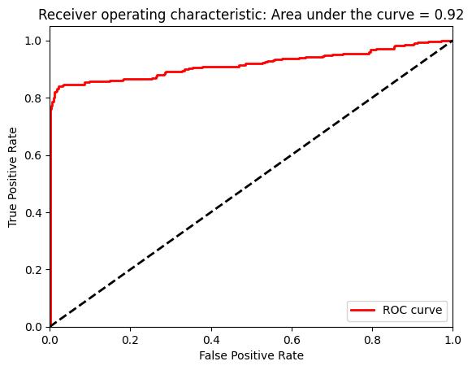

# Graph Neural Networks (GNNs) for Android Malware Detection

## Overview

This project explores the application of Graph Neural Networks (GNNs) to detect Android malware using the CIC-AndMal2017 dataset. GNNs are deep learning models that predict data structures represented as graphs, capturing relationships between entities (nodes) and their connections (edges). The project focuses on GNN models is Graph Autoencoders (GAEs), to classify Android applications as benign or malicious.

## Models

### Graph Autoencoders (GAE)
GAEs learn meaningful representations of graph data for various tasks, such as node classification, link prediction, and graph clustering. They consist of an encoder that learns topological and node feature embeddings and a decoder that reconstructs the graph from these embeddings.

## Dataset

The dataset used in this project is the **CIC-AndMal2017** Android malware dataset, consisting of 2126 CSV files. Each file corresponds to network flows captured from Android applications at three stages:

- **Installation**: Immediately after the app is installed.
- **Before Reboot**: 15 minutes before the device is rebooted.
- **After Reboot**: 15 minutes after the device is rebooted.

The dataset contains 85 fields describing each flow, and the files are categorized into Adware, Ransomware, Scareware, SMS Malware, and Benign groups.

## Data Processing

The data is processed to construct **flow graphs** where:

- **Nodes**: Represent endpoints involved in any flow.
- **Edges**: Represent flows between endpoints.
- **Edge Features**: Aggregated using five statistical functions—mean, standard deviation, skewness, kurtosis, and median—resulting in a 295-dimensional feature vector per edge.

### Labels
- **0**: Benign graphs
- **1**: Malware graphs

## Model Implementation

### Network Flow Graph Autoencoder

An **Autoencoder** model is used for unsupervised anomaly detection, consisting of:

1. **Encoder**: Compresses edge features.
2. **Decoder**: Reconstructs the graph, where reconstruction error indicates anomaly score.

High anomaly scores suggest malicious activity.

### Evaluation Metrics

- **Precision-Recall Curve**
- **AUC-ROC Curve**

These metrics are used to evaluate the model's performance, with a higher AUC indicating better discrimination between benign and malware graphs.

## References

- Data Source: [CIC-AndMal2017](https://www.unb.ca/cic/datasets/andmal2017.html)
- 
[1] Trinh Quang, “Giới thiệu về Graph Neural Networks (GNNs)” 30 Oct 2023, https://viblo.asia/p/gioi-thieu-ve-graph-neural-networks-gnns-yZjJYG7MVOE

[2] Matthew N. Bernstein, “Graph convolutional neural networks”, 24 September 2023, https://mbernste.github.io/posts/gcn/

[3] “Graph Autoencoders”, https://www.activeloop.ai/resources/glossary/graphautoencoders/

[4] “AUC ROC Curve in Machine Learning”, https://www.geeksforgeeks.org/aucroc-curve/

[5] Arash Habibi Lashkari, Andi Fitriah A. Kadir, Laya Taheri, and Ali A. Ghorbani, “Toward Developing a Systematic Approach to Generate Benchmark Android Malware Datasets and Classification”, In the proceedings of the 52nd IEEE International Carnahan Conference on Security Technology (ICCST), Montreal, Quebec, Canada, 2018.

[6] Raghavendra Chalapathy and Sanjay Chawla. 2019. Deep learning for anomaly detection: A survey. arXiv preprint arXiv:1901.03407 (2019).

[7] Julian Busch, Anton Kocheturov, Volker Tresp, Thomas Seidl “NF-GNN: Network Flow Graph Neural Networks for Malware Detection and Classification” pp.4-5, July 6–7, 2021, doi: 2103.03939

